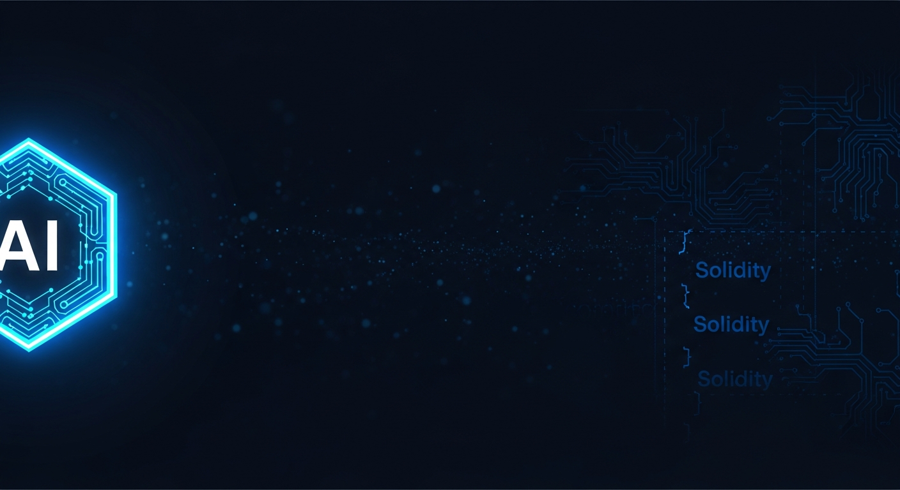
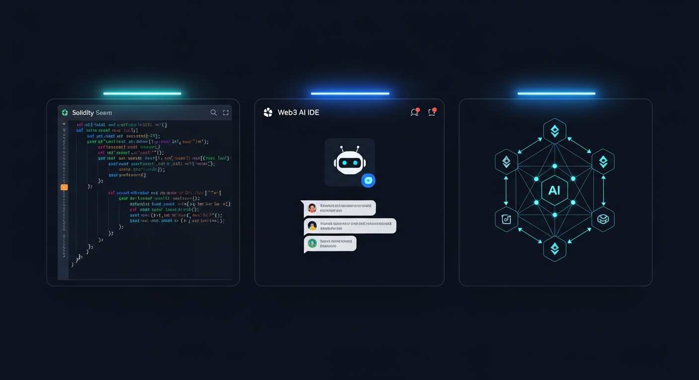
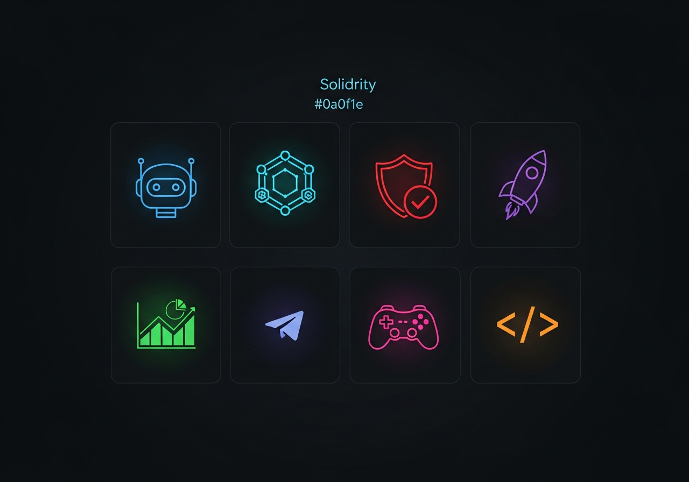

<div align="center">



<br />
<br />


# Agunnaya AI Studio

**The AI-native Web3 development platform — build smart contracts, dApps, and on-chain games 10× faster.**

<br />

[](https://github.com/Agunnaya-Labs/agunnaya-ai-studio/stargazers)
[](https://github.com/Agunnaya-Labs/agunnaya-ai-studio/network)
[](https://github.com/Agunnaya-Labs/agunnaya-ai-studio/issues)
[](LICENSE)

<br />

[](https://www.typescriptlang.org/)
[](https://nodejs.org/)
[](https://react.dev/)
[](https://vite.dev/)
[](https://expo.dev/)
[](https://supabase.com/)
[](https://openai.com/)
[](https://orm.drizzle.team/)
[](https://pnpm.io/)
[](https://tailwindcss.com/)

<br />

[**Live Demo**](https://agunnaya-ai-studio.replit.app) · [**Report Bug**](https://github.com/Agunnaya-Labs/agunnaya-ai-studio/issues) · [**Request Feature**](https://github.com/Agunnaya-Labs/agunnaya-ai-studio/issues) · [**Discord**](https://discord.gg/agunnaya)

</div>

---

## Overview

Agunnaya AI Studio is a full-stack, AI-native development environment purpose-built for the Web3 ecosystem. It combines a powerful browser-based **Solidity IDE**, **8 specialized AI coding agents**, **multi-chain smart contract deployment**, and a **GameFi rewards engine** — all in one platform. Available as both a web app and a native mobile app.

<div align="center">

</div>

---

## ✨ Key Features

### 🤖 AI Studio — 8 Specialized Agents
<div align="center">

</div>

| Agent | Specialty |
|---|---|
| 🤖 **AI Assistant** | General-purpose Web3 coding companion |
| 💎 **Solidity Expert** | Smart contract architecture, ERC standards, gas optimization |
| 🎨 **Frontend Dev** | React dApp UI, wagmi/ethers.js integration |
| ⚙️ **Backend Dev** | Node.js APIs, indexers, The Graph subgraphs |
| 🛡️ **Security Auditor** | Reentrancy, overflow, access-control vulnerability analysis |
| 🚀 **Deploy Agent** | Multi-chain deployment scripts, Hardhat/Foundry configs |
| 🎮 **GameFi Designer** | On-chain game mechanics, tokenomics, NFT reward systems |
| 📱 **Telegram Bot** | Web3 Telegram bot with wallet connect and contract calls |

All agents stream responses in real-time via the Vercel AI SDK, with server-side system prompts ensuring deep domain expertise.

### 🖥️ Dev Playground
- **Monaco Editor** — full VS Code engine in the browser with Solidity syntax highlighting
- Virtual file tabs, template library (ERC-20, ERC-721, Staking Pool, blank)
- AI-assisted code suggestions that read your current file context
- Export / download contracts directly

### ⛓️ Multi-Chain Deploy
- One-click deployment to **Base Sepolia**, **Base Mainnet**, **Ethereum**, **Polygon**
- Wallet connect modal: Coinbase Wallet, MetaMask, WalletConnect
- Gas estimation, deployment history, contract verification links

### 🎮 GameFi Engine
- XP system with level progression and daily reward claims
- Quest tracker, achievement badge grid, global leaderboard
- On-chain points tied to platform milestones

### 🌐 Community Hub
- Live developer feed with likes, comments, and reposts
- Featured Builders spotlight, trending projects sidebar
- Compose with hashtag shortcuts (`#solidity`, `#defi`, `#nft`)

### 🛒 Marketplace
- **12 smart contract templates** across DeFi, NFT, DAO, GameFi, and Utility categories
- **4 premium AI agent add-ons** with per-request billing
- One-click install into your active project

### 🔑 Ecosystem & API
- Self-service API key management with usage quotas
- SDK docs in TypeScript, Python, and Go
- Webhook registration for on-chain event subscriptions
- Real-time analytics dashboard

### 💳 Billing & Plans
| Plan | Price | AI Requests | Deployments | Agents |
|---|---|---|---|---|
| Free | $0 | 100 / mo | 3 | 2 |
| Pro | $29 / mo | 2,000 / mo | Unlimited | 5 |
| Studio | $99 / mo | 10,000 / mo | Unlimited | All 8 |
| Enterprise | Custom | Unlimited | Unlimited | All 8 + custom |

---

## 📱 Mobile App

A full-featured **Expo React Native** companion app is available for iOS and Android:
- Native authentication via Supabase
- AI Studio chat with streaming (connects to the same API)
- Real-time dashboard stats
- Profile management

---

## 🏗 Architecture

```
agunnaya-ai-studio/
├── artifacts/
│   ├── agunnaya-ai/          # React + Vite web app  (port: $PORT, path: /)
│   │   ├── src/
│   │   │   ├── pages/
│   │   │   │   ├── home/              # Landing page
│   │   │   │   ├── auth/              # Login, signup, callback, error
│   │   │   │   └── dashboard/         # All 13 dashboard pages
│   │   │   │       ├── index.tsx      # Overview
│   │   │   │       ├── studio.tsx     # AI Studio (8 agents)
│   │   │   │       ├── playground.tsx # Monaco IDE
│   │   │   │       ├── deploy.tsx     # Multi-chain deploy
│   │   │   │       ├── gamefi.tsx     # XP / quests / leaderboard
│   │   │   │       ├── community.tsx  # Social feed
│   │   │   │       ├── marketplace.tsx
│   │   │   │       ├── billing.tsx
│   │   │   │       ├── ecosystem.tsx  # API keys + SDK
│   │   │   │       ├── projects.tsx
│   │   │   │       ├── api-keys.tsx
│   │   │   │       └── settings.tsx
│   │   │   ├── components/
│   │   │   │   └── dashboard-layout.tsx   # Shared sidebar + nav
│   │   │   ├── hooks/
│   │   │   │   └── useDashboardUser.ts    # Auth guard hook
│   │   │   └── lib/
│   │   │       └── supabase.ts            # Supabase client factory
│   │   └── index.html
│   │
│   ├── api-server/           # Express 5 REST API  (path: /api)
│   │   └── src/
│   │       ├── routes/
│   │       │   └── chat.ts   # Streaming AI chat, 8 agent system prompts
│   │       └── index.ts
│   │
│   └── agunnaya-ai-mobile/   # Expo React Native (iOS + Android)
│       └── app/
│           ├── (tabs)/
│           │   ├── index.tsx  # Dashboard
│           │   ├── chat.tsx   # AI Studio
│           │   └── profile.tsx
│           └── auth/
│
├── lib/
│   ├── db/src/schema/         # Drizzle ORM schema (source of truth)
│   └── api-spec/openapi.yaml  # OpenAPI 3.1 spec (source of truth)
│
└── pnpm-workspace.yaml
```

### Data Flow

```
Browser / Mobile App
       │
       ▼
  Supabase Auth  ─────────────────────────────────────┐
       │                                              │
       ▼                                              │
  Express API (/api)                          JWT Verification
       │
       ├── POST /api/chat  ──► Vercel AI SDK ──► OpenAI GPT-4o
       │         └── streams tokens back via SSE
       └── ...future routes
```

---

## 🚀 Getting Started

### Prerequisites

| Tool | Version |
|---|---|
| Node.js | ≥ 24 |
| pnpm | ≥ 9 |
| Git | any |

### 1. Clone

```bash
git clone https://github.com/Agunnaya-Labs/agunnaya-ai-studio.git
cd agunnaya-ai-studio
pnpm install
```

### 2. Configure Secrets

Create a project on [Supabase](https://supabase.com) and grab your URL + anon key. Get an [OpenAI API key](https://platform.openai.com/api-keys).

```bash
# Web app
VITE_SUPABASE_URL=https://xxxxxxxxxxxx.supabase.co
VITE_SUPABASE_ANON_KEY=your-anon-key

# API server
SUPABASE_URL=https://xxxxxxxxxxxx.supabase.co
SUPABASE_ANON_KEY=your-anon-key
OPENAI_API_KEY=sk-...

# Mobile
EXPO_PUBLIC_SUPABASE_URL=https://xxxxxxxxxxxx.supabase.co
EXPO_PUBLIC_SUPABASE_ANON_KEY=your-anon-key
EXPO_PUBLIC_DOMAIN=your-api-domain.com
```

### 3. Run

```bash
# All three services in parallel (web + API + mobile)
pnpm --filter @workspace/agunnaya-ai run dev
pnpm --filter @workspace/api-server run dev
pnpm --filter @workspace/agunnaya-ai-mobile run dev
```

Open [http://localhost:5173](http://localhost:5173) for the web app.

### 4. Optional: Regenerate API client

```bash
pnpm --filter @workspace/api-spec run codegen
```

---

## 🛠 Tech Stack

### Web App
| Layer | Technology |
|---|---|
| Framework | React 19 + Vite 6 |
| Routing | wouter |
| Styling | Tailwind CSS v4 |
| Icons | lucide-react |
| Editor | Monaco Editor (`@monaco-editor/react`) |
| Auth | Supabase (`@supabase/supabase-js`) |
| AI streaming | Vercel AI SDK (`ai`) |

### API Server
| Layer | Technology |
|---|---|
| Runtime | Node.js 24, TypeScript 5.9 |
| Framework | Express 5 |
| AI | Vercel AI SDK + `@ai-sdk/openai` |
| Validation | Zod v4 |
| DB ORM | Drizzle ORM |
| Database | PostgreSQL |

### Mobile App
| Layer | Technology |
|---|---|
| Framework | Expo 52 + React Native |
| Navigation | Expo Router (file-based) |
| Auth | Supabase |
| Styling | React Native StyleSheet + Linear Gradient |

### Infrastructure
| Concern | Tool |
|---|---|
| Monorepo | pnpm workspaces |
| API contract | OpenAPI 3.1 YAML |
| Type safety | TypeScript project references |
| DB schema | Drizzle ORM + drizzle-zod |

---

## 🗺 Roadmap

| Phase | Status | Feature |
|---|---|---|
| 1 | ✅ | Landing page, auth (email + OAuth), Supabase |
| 2 | ✅ | Dashboard, stats, getting-started checklist |
| 3 | ✅ | AI Studio with 8 specialized agents + real streaming |
| 4 | ✅ | Dev Playground — Monaco editor + Solidity templates |
| 5 | ✅ | Web3 Deploy — multi-chain, wallet connect |
| 6 | ✅ | GameFi — XP, quests, achievements, leaderboard |
| 7 | ✅ | Community hub — feed, compose, builders |
| 8 | ✅ | Marketplace + Billing with 4 subscription tiers |
| 9 | ✅ | Ecosystem — API keys, SDK docs, webhooks |
| 10 | ✅ | Mobile app (Expo iOS + Android) |
| 11 | 🔜 | Live contract compilation via Hardhat in-browser |
| 12 | 🔜 | On-chain XP/achievement NFTs |
| 13 | 🔜 | Collaborative multiplayer editing |
| 14 | 🔜 | GitHub integration — push contracts directly |
| 15 | 🔜 | AI-powered security audit reports (PDF export) |

---

## 🤝 Contributing

Contributions are welcome! Please read the guidelines below before opening a PR.

```bash
# Fork the repo, clone your fork
git clone https://github.com/agunnaya001/agunnaya-ai-studio.git

# Create a feature branch
git checkout -b feat/your-feature-name

# Make changes, then run typecheck
pnpm run typecheck

# Push and open a PR against main
git push origin feat/your-feature-name
```

**Guidelines:**
- Follow the existing code style (TypeScript strict mode, Tailwind utility classes)
- All dashboard pages must use `useDashboardUser()` + `DashboardLayout`
- API routes must verify the Supabase JWT before processing
- New AI agents: add the system prompt to `AGENT_PROMPTS` in `chat.ts` and the UI card in `studio.tsx`
- Commit messages: `feat:`, `fix:`, `refactor:`, `docs:`, `chore:` prefixes

---

## 👥 Team & Organization

| | |
|---|---|
| **Author** | [@agunnaya001](https://github.com/agunnaya001) |
| **Organization** | [Agunnaya Labs](https://github.com/Agunnaya-Labs) |
| **Twitter / X** | [@agunnaya001](https://x.com/agunnaya001) |
| **Discord** | [discord.gg/agunnaya](https://discord.gg/agunnaya) |

---

## 📄 License

This project is licensed under the **MIT License** — see the [LICENSE](LICENSE) file for details.

---

## 🙏 Acknowledgements

- [Vercel AI SDK](https://sdk.vercel.ai/) — streaming AI primitives
- [Supabase](https://supabase.com/) — auth + database
- [OpenAI](https://openai.com/) — GPT-4o model
- [Monaco Editor](https://microsoft.github.io/monaco-editor/) — browser-based VS Code engine
- [Drizzle ORM](https://orm.drizzle.team/) — type-safe PostgreSQL ORM
- [Expo](https://expo.dev/) — React Native for iOS + Android
- [Tailwind CSS](https://tailwindcss.com/) — utility-first styling

---

<div align="center">

**Built with ❤️ by [Agunnaya Labs](https://github.com/Agunnaya-Labs)**

<br />

[](https://github.com/agunnaya001)
[](https://github.com/Agunnaya-Labs)

<br />

⭐ **If this project helped you, please give it a star!** ⭐

</div>
